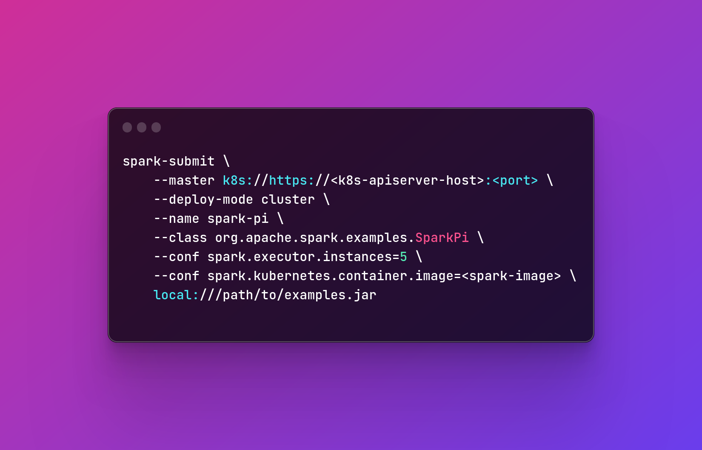
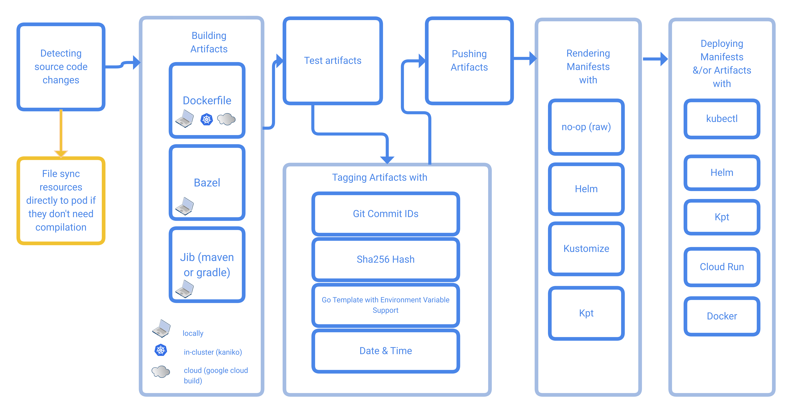

In today's data-driven world, the ability to efficiently process and analyze large datasets is crucial. Apache Spark has been a go-to solution for big data processing, while Kubernetes has emerged as a leading platform for container orchestration. Together, these two technologies form a potent combination, offering a scalable and flexible environment for managing and executing Spark workloads.

In this context, we want to share our take aways from migrating old Spark Standalone clusters to kubernetes using Spark Submit.

# Project context
The client's infrastructure is build on top of OpenStack, thus most of services are installed manually or using Ansible, on top of virtual machines. With these constraints, the big data team has build multiple Spark Standalone clusters for each of their environments.

# Migration Goals & Constraints

**Constraints** 

The client is very demanding regarding security and authorization, thus the architects forbidden different teams from installing k8s operators.

**Goals** 

The integration of Apache Spark with Kubernetes has opened up new horizons for running Spark workloads in a more efficient and flexible manner. Here's why this combination is so compelling:

**1. Resource Management and Isolation**

Kubernetes provides fine-grained control over resources, enabling Spark applications to be isolated in containers with specific CPU and memory limits. This ensures that Spark jobs don't contend for resources with other applications running on the same cluster.

**2. Scalability**

Kubernetes makes it easy to scale Spark clusters up or down based on workload demands. This dynamic scaling ensures optimal resource utilization, reducing infrastructure costs.

**3. Multi-Tenancy**

Kubernetes supports multi-tenancy, allowing different teams or users to share the same cluster securely. Each Spark application can run within its own namespace, ensuring data and resource isolation.

**4. Portability**

With Kubernetes, you can deploy Spark applications consistently across various environments, from on-premises data centers to public clouds. This portability simplifies deployment and minimizes compatibility issues.

**5. Simplified Operations**

Kubernetes abstracts away many of the complexities associated with managing Spark clusters. It automates tasks like scaling, monitoring, and recovery, reducing the operational overhead.

**6. Efficient Resource Utilization**

Kubernetes' bin-packing capabilities ensure efficient use of cluster resources. Spark pods are scheduled on worker nodes with available resources, minimizing wastage.

# Getting Started with Spark on Kubernetes

TBD

## How Spark Works on Kubernetes

TBD

## Spark-Submit vs Spark Operator
`spark-submit` and the Spark Operator are two different approaches for running Apache Spark applications on Kubernetes. Each has its own advantages and use cases, and the choice between them depends on your specific requirements and infrastructure setup.

* Use spark-submit when:
  * You need maximum flexibility and control over Spark configurations.
  * You are already comfortable with the spark-submit command.
  * Your Spark applications need to run in various cluster environments.

* Use Spark Operator when:
  * You want a Kubernetes-native, automated solution.
  * You prefer to define and manage Spark applications as Kubernetes resources.
  * You need dynamic scaling and resource management features.
  * You are using Kubernetes extensively in your infrastructure.

## Dynamic Scaling

Dynamic scaling refers to the ability to automatically adjust the number of Spark executors in response to workload demands. This feature allows applications to efficiently utilize cluster resources while maintaining optimal performance.

1. **Initial Deployment**:
   When you submit a Spark application to run on Kubernetes, you define an initial number of executor pods based on your workload requirements and resource availability. These executor pods run alongside the Spark driver pod.

2. **Monitoring Metrics**: 
   Kubernetes, along with monitoring tools like Prometheus and Grafana, collects metrics about the Spark application's resource usage, such as CPU and memory consumption, as well as the progress of tasks within the application.

3. **Resource Utilization Thresholds**:
   You can configure resource utilization thresholds or policies that define when the cluster should scale up or down based on predefined criteria. These thresholds are often defined in terms of CPU and memory utilization.

4. **Scaling Trigger**:
   When the metrics collected breach the predefined thresholds, Kubernetes triggers the scaling process. If resource utilization is consistently high and exceeds the defined threshold, Kubernetes initiates the scaling up process to allocate more resources to the Spark application.

5. **Scaling Up**:
   - Kubernetes increases the desired number of Spark executor pods by creating new pods.
   - These new executor pods join the existing Spark driver pod and executor pods to distribute the workload.
   - The Spark application can take advantage of the additional resources to process data faster.

6. **Continued Monitoring**:
   Kubernetes and monitoring tools continue to monitor the Spark application's resource usage. If resource utilization drops below a certain threshold or the workload decreases, Kubernetes may trigger a scaling down process to reduce the number of executor pods.

7. **Scaling Down**:
   - Kubernetes gracefully terminates the selected executor pods.
   - Spark gracefully handles the termination of these executor pods, ensuring that in-progress tasks are not lost and that data is not corrupted.
   - Once the executor pods have been safely terminated, the Spark application continues to run with the remaining resources.

8.  **Iterative Process**:
   Dynamic scaling is an iterative process that can occur multiple times during the execution of a Spark application. It allows the application to adapt to changing resource demands, ensuring efficient resource utilization without manual intervention.

# Deploying a Spark Application

TBD

## Requirements

TBD

## Setting up a Skaffold project

[**Skaffold**](https://skaffold.dev/) is a command line tool that facilitates continuous development for container based & Kubernetes applications. 

[**Kustomize**](https://kustomize.io/)

## Kubernetes Components

### Spark Submit Image

### Spark Submit Service

### Using Pod Template

### 

## Deploying the Spark Pi Demo Application

TBD

## Checking the logs

TBD

## Accessing the Spark UI

TBD

## Spark Job Execution History

TBD

## Monitoring

TBD

# Pros and Cons of Spark Submit with K8s

TBD

**Pros of Spark with K8s:**
* ...
* ...

**Cons of Spark with K8s:**
* ...
* ...

# Conclusion
TBD