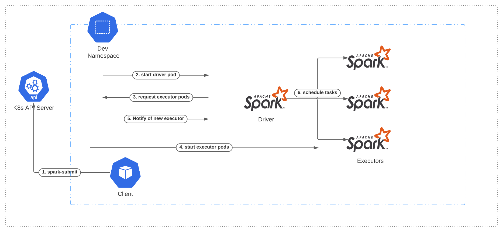
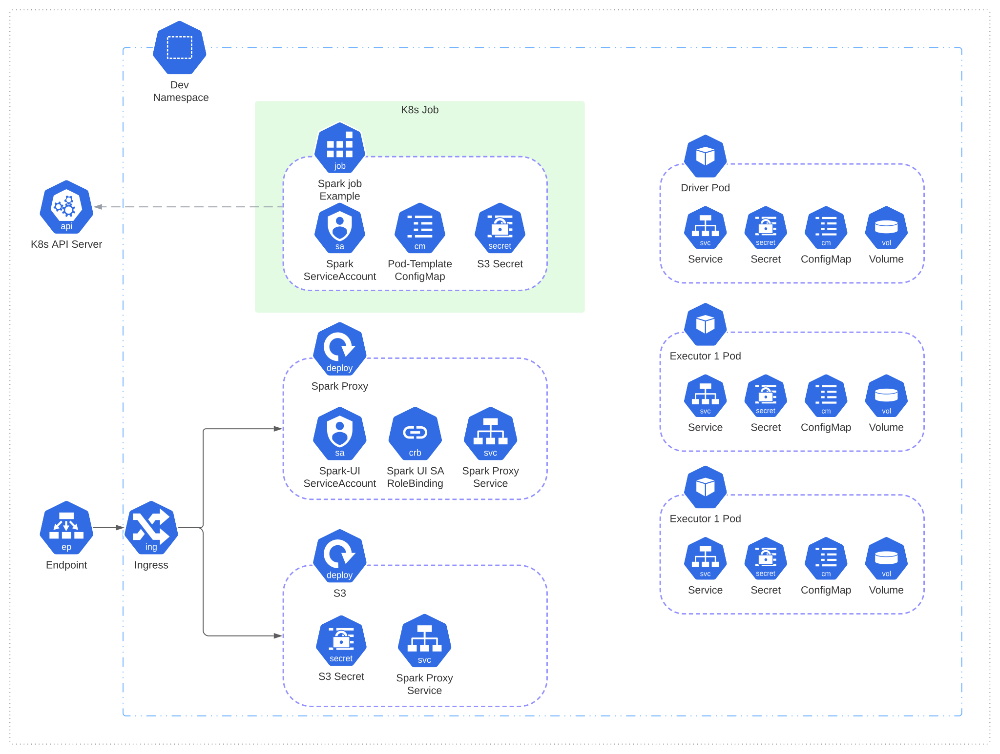
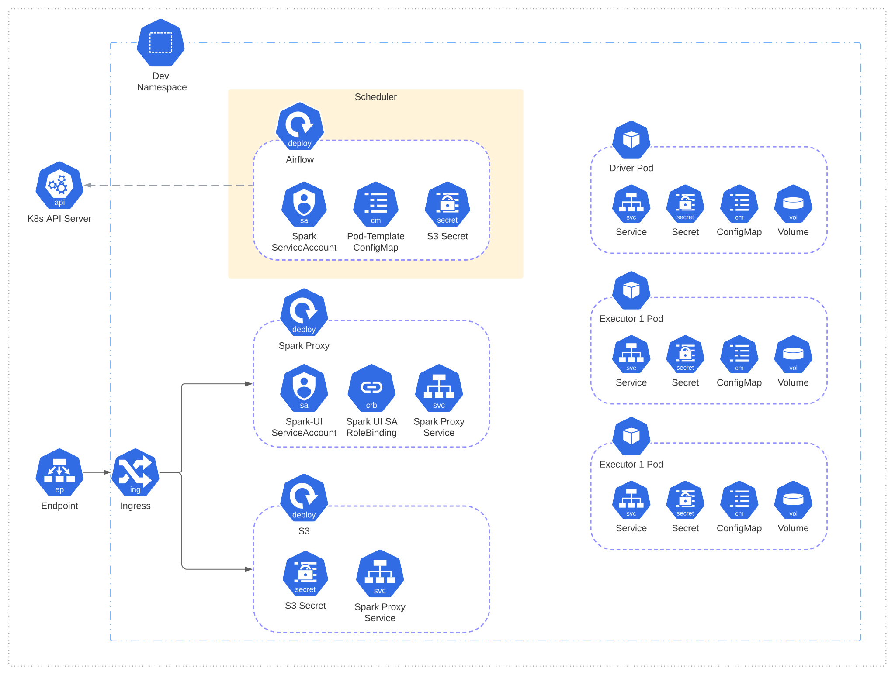

import Collapse from '@site/src/components/collapse';
import Badge from '@site/src/components/badge';
import Tabs from '@theme/Tabs';
import TabItem from '@theme/TabItem';
import {CollapseGithubCodeBlock} from '@site/src/components/github-codeblock';

import Author from '@theme/BlogPostItem/Header/Author';


<Author author={{name: "Hamza EL KAROUI", title: "Freelance, Senior Data Engineer / DevOps", url: "/about", imageURL: "https://images.weserv.nl/?url=avatars.githubusercontent.com/u/22795356?s=96&v=4&fit=cover&mask=circle&maxage=7d", email: "dd"}} />


<br/>

:::warning

This article is still in review 🚧 by the co-authors.

:::


In today's data-driven world, the ability to efficiently process and analyze large datasets is crucial. Apache Spark has been a go-to solution for big data processing, while Kubernetes has emerged as a leading platform for container orchestration. Together, these two technologies form a potent combination, offering a scalable and flexible environment for managing and executing Spark workloads.

In this context, we want to share our take aways from migrating old Spark Standalone clusters to kubernetes using Spark Submit.


## Project context
The client's infrastructure is build on top of OpenStack, thus most of services are installed manually or using Ansible, on top of virtual machines. With these constraints, the big data team has build multiple Spark Standalone clusters for each of their environments.

### Goals & Constraints

:::info

**Dynamic Scaling**
Dynamic scaling refers to the ability to automatically adjust the number of Spark executors in response to workload demands. This feature allows applications to efficiently utilize cluster resources while maintaining optimal performance.


<Collapse title="Learn more ...">

1. **Initial Deployment**:
  When you submit a Spark application to run on Kubernetes, you define an initial number of executor pods based on your workload requirements and resource availability. These executor pods run alongside the Spark driver pod.

2. **Monitoring Metrics**: 
  Kubernetes, along with monitoring tools like Prometheus and Grafana, collects metrics about the Spark application's resource usage, such as CPU and memory consumption, as well as the progress of tasks within the application.

3. **Resource Utilization Thresholds**:
  You can configure resource utilization thresholds or policies that define when the cluster should scale up or down based on predefined criteria. These thresholds are often defined in terms of CPU and memory utilization.

4. **Scaling Trigger**:
  When the metrics collected breach the predefined thresholds, Kubernetes triggers the scaling process. If resource utilization is consistently high and exceeds the defined threshold, Kubernetes initiates the scaling up process to allocate more resources to the Spark application.

5. **Scaling Up**:
  - Kubernetes increases the desired number of Spark executor pods by creating new pods.
  - These new executor pods join the existing Spark driver pod and executor pods to distribute the workload.
  - The Spark application can take advantage of the additional resources to process data faster.

6. **Continued Monitoring**:
  Kubernetes and monitoring tools continue to monitor the Spark application's resource usage. If resource utilization drops below a certain threshold or the workload decreases, Kubernetes may trigger a scaling down process to reduce the number of executor pods.

7. **Scaling Down**:
  - Kubernetes gracefully terminates the selected executor pods.
  - Spark gracefully handles the termination of these executor pods, ensuring that in-progress tasks are not lost and that data is not corrupted.
  - Once the executor pods have been safely terminated, the Spark application continues to run with the remaining resources.

8.  **Iterative Process**:
Dynamic scaling is an iterative process that can occur multiple times during the execution of a Spark application. It allows the application to adapt to changing resource demands, ensuring efficient resource utilization without manual intervention.

</Collapse>

:::


### Architecture


#### Spark-Submit Architecture
Spark Submit can be used to submit a Spark Application directly to a Kubernetes cluster. The flow would be as follows:



1. The client, that lives outside or inside the kubernetes cluster, submit an application and asks the k8s API to create the driver
2. k8s creates Spark driver running within a Kubernetes pod.
3. The driver requests k8s to create executors which are also running within Kubernetes pods.
4. k8s creates the executors 
5. The driver is notified and connects to them.
6. The driver executes application code on executors.

When the application completes, the executor pods terminate and are cleaned up, but the driver pod persists logs and remains in “completed” state in the Kubernetes API until it’s eventually garbage collected or manually cleaned up.


:::note

Note that in the completed state, the driver pod does not use any computational or memory resources.

:::


:::info

There is another approche to schedule spark application on kubernetes, which by using a `Spark Operator`. The operator should be installed into kubernetes cluster.

Each has its own advantages and use cases, and the choice between them depends on your specific requirements and infrastructure setup.

* Use spark-submit when:
  * You need maximum flexibility and control over Spark configurations.
  * You are already comfortable with the spark-submit command.
  * Your Spark applications need to run in various cluster environments.

* Use Spark Operator when:
  * You want a Kubernetes-native, automated solution.
  * You prefer to define and manage Spark applications as Kubernetes resources.
  * You need dynamic scaling and resource management features.
  * You are using Kubernetes extensively in your infrastructure.

:::


#### Project Architecture

In this project, we will showcase two ways to schedule Spark applications on kubernetes:
- Native Kubernetes solution: using kubernetes Job resource type to submit the application.
- Scheduler: using Airflow to schedule application.

For these two solutions we propose the following architectures :

<Tabs>
  <TabItem value="apple" label="Using Kubernetes jobs" default>
  <div style={{padding: '20px', 'background-color': '#f6f8fa'}}>

*What is a kubernetes Job ?*
> A Job creates one or more Pods and will continue to retry execution of the Pods until a specified number of them successfully terminate. As pods successfully complete, the Job tracks the successful completions. 
>
> — kubernetes.io

For more details about jobs, check the [kubernetes docs](https://kubernetes.io/docs/concepts/workloads/controllers/job/).




  </div>
  </TabItem>
  <TabItem value="orange" label="Using a scheduler: Airflow">
    <div style={{padding: '20px', 'background-color': '#f6f8fa'}}>

*What is a kubernetes Job ?*
> Apache Airflow™ is an open-source platform for developing, scheduling, and monitoring batch-oriented workflows. Airflow’s extensible Python framework enables you to build workflows connecting with virtually any technology.
> 
> — airflow.apache.org

For more details about Airflow, check the [officiel website](https://airflow.apache.org/).




  </div>
  </TabItem>
</Tabs>


## Getting Started

I recommand you to download the project source code from my Github Repo <Badge color="rgb(168, 255, 236)"> [helkaroui/spark-on-k8s](https://github.com/helkaroui/spark-on-k8s) </Badge>  , and try to follow the following steps. It will help you to understand the different sections by stadying the code.

### Requirements
In this project we will need to setup the following tools :

#### Container & Infrastructure
- [**Docker**](https://docs.docker.com/engine/install/)

<Collapse title="How to install Docker ?">

Set up Docker's Apt repository:
```bash
  sudo apt-get update
  && sudo apt-get install ca-certificates curl gnupg
  && sudo install -m 0755 -d /etc/apt/keyrings
  && curl -fsSL https://download.docker.com/linux/ubuntu/gpg | sudo gpg --dearmor -o /etc/apt/keyrings/docker.gpg
  && sudo chmod a+r /etc/apt/keyrings/docker.gpg
  && echo "deb [arch="$(dpkg --print-architecture)" signed-by=/etc/apt/keyrings/docker.gpg] https://download.docker.com/linux/ubuntu
    "$(. /etc/os-release && echo "$VERSION_CODENAME")" stable" | sudo tee /etc/apt/sources.list.d/docker.list > /dev/null
  && sudo apt-get update
```

To install the latest version, run:

```bash
sudo apt-get install -y docker-ce docker-ce-cli containerd.io docker-buildx-plugin docker-compose-plugin
```

Now add your user to the Docker group:

```bash
sudo usermod -aG docker $USER && newgrp docker
```

Verify that the Docker Engine installation is successful by running the hello-world image.

```bash
sudo docker run hello-world
```

</Collapse>

- [**Minikube**](https://minikube.sigs.k8s.io/docs/start/) is local Kubernetes, focusing on making it easy to learn and develop for Kubernetes.kube

<Collapse title="How to install Minikube ?">

To install the latest version, run:
```bash
curl -LO https://storage.googleapis.com/minikube/releases/latest/minikube-linux-amd64
sudo install minikube-linux-amd64 /usr/local/bin/minikube && rm minikube-linux-amd64
```
Verify that the Minikube installation is successful by starting it:
```bash
minikube start
```

You can check the available node by running:
```bash
minikube kubectl get nodes
```

And you can access the Dashboard with this command, the Dashboard will be launched at [localhost:41169](http://localhost:41169)

```bash
minikube dashboard
```

</Collapse>


- [**kubectl**](https://kubernetes.io/fr/docs/tasks/tools/install-kubectl/) is a command line tool used to run commands against Kubernetes clusters.

<Collapse title="How to install Kubectl ?">

For kubectl, we can either install it, or create an alias to `minikube kubectl`.

*Method 1*: Install kubectl
```bash
curl -LO "https://dl.k8s.io/release/$(curl -L -s https://dl.k8s.io/release/stable.txt)/bin/linux/amd64/kubectl" \
&& sudo install -o root -g root -m 0755 kubectl /usr/local/bin/kubectl \
&& rm kubectl
```

*Method 2:* For simplicity, we will add an alias to our .bashrc file and apply it:
```bash
vim ~/.bashrc

# Add this line at the end
alias kubectl=minikube kubectl
# Save and apply the file

source ~/.bashrc
```

</Collapse>

#### Dev tools

- [**Kustomize**](https://kustomize.io/) is a Kubernetes configuration transformation tool that allows you to customize untemplated YAML files, leaving the original files intact.

<Collapse title="How to install Kustomize ?">

To install :
```bash
curl -s "https://raw.githubusercontent.com/kubernetes-sigs/kustomize/master/hack/install_kustomize.sh"  | bash \
&& sudo install kustomize /usr/local/bin/ \
&& rm kustomize
```

Verify setup:
```bash
kustomize version
```

</Collapse>

- [**Skaffold**](https://skaffold.dev/) is a command line tool that facilitates continuous development for container based & Kubernetes applications.

<Collapse title="How to install Skaffold ?">

To install :
```bash
curl -Lo skaffold https://storage.googleapis.com/skaffold/releases/v2.0.4/skaffold-linux-amd64 \
&& chmod +x skaffold \
&& sudo mv skaffold /usr/local/bin
```

Verify setup:
```bash
skaffold version
```

</Collapse>

:::note

Skaffold handles the workflow for building, pushing and deploying your application. It is similar to `Docker-compose` for kubernetes.
This enables you to focus on iterating on your application locally while Skaffold continuously deploys to your local or remote Kubernetes cluster, local Docker environment or Cloud Run project.

<Collapse title="How it works in short ?">


</Collapse>

Follow this [officiel tutorial](https://skaffold.dev/docs/quickstart/) if you’re using to Skaffold. It walks through running Skaffold on a small Kubernetes app built with Docker inside minikube and deployed with kubectl.

:::


### The project structure

We will start by creating a project with a structure that emphasis the separation of rules, i.e. we seperate the code base, the service component and the environment specifics on which the application will run. This concept is also called `Environment-Agnostic Design` also known as `environment-agnostic architecture` or `platform-agnostic design`.

In that sperit, here is our project structure :

```
├── images
│   ├── base-images
│   │   └── spark-base-image
│   └── custom-images
│       └── spark-app-example
├── services
│   ├── sparkhs
│   ├── spark-submit-job
│   └── spark-reverse-proxy
└── deployment
    ├── base
    └── overlays
        ├── dev
        └── prod
```

- **images :** The docker images folder is where lives our code base, it can also be split into two folders :
  - *base-images* for base docker that will be used to build other images. Example : spark, jdk, python, sbt, gradle.
  - *custom-images* which can enhirit from base images, and holds images with our code base.

- **services :** Here we define the services that will run our docker images on kubernetes.

- **Deployment :** this folder holds resources and variants of environment configurations - like `development`, `staging` and `production` - using overlays that modify a common base.


### Building docker images

#### Spark Base Image

We decided to create a custom spark docker image rather than using the provided docker image, in order to showcase the possibility of customizing Spark upon the project needs.


The easiest way is to mimic the Dockerfile located in Spark [Repository](https://github.com/apache/spark/blob/master/resource-managers/kubernetes/docker/src/main/dockerfiles/spark/Dockerfile)


We reduce the dockerfile to it's minimum and we add a stage to build spark from source using maven.

<CollapseGithubCodeBlock title="images/base-images/spark-base-image/Dockerfile" url="https://raw.githubusercontent.com/helkaroui/spark-on-k8s/master/images/base-images/spark-base-image/Dockerfile" language="docker"/>


:::note

At this point, we can test everything by building the docker image `docker build .` The build will take couple of minutes, since we are compiling the source code. 

We can of course replace this section, and download the binaries from [https://spark.apache.org](https://spark.apache.org), to reduce the build time. But the aim here is to be able to easily customize Spark, add libraries and adapt it to our needs.

:::


#### Spark App Example Image

To showcase a fully working spark application, we create a basic Scala/Spark application with two scripts :
- *Compute Pi* this script will compute an approximation to PI and log the result. The code is also included in [Spark-Examples](https://github.com/apache/spark/blob/master/examples/src/main/scala/org/apache/spark/examples/SparkPi.scala) module.
- *Streaming Example* A basic streaming script with Spark structured streaming.

We first start by creating an SBT project as follow :

1- `cd` to the folder `images/custom-images/`.

2- Run the following command `sbt new scala/scala3.g8`. This pulls the ‘scala3’ template from GitHub. It will also create a target folder, which you can ignore.

3- When prompted, name the application `spark-app-example`. This will create a project called “spark-app-example”.

4- Let’s take a look at what just got generated:
```
├── build.sbt
├── project
│   └── build.properties
├── README.md
└── src
    ├── main
    │   └── scala
    │       └── Main.scala
    └── test
        └── scala
            └── MySuite.scala
```

5- Adding a dependency in the `build.sbt` file :
<CollapseGithubCodeBlock title="images/custom-images/spark-app-example/build.sbt" url="https://raw.githubusercontent.com/helkaroui/spark-on-k8s/master/images/custom-images/spark-app-example/build.sbt" language="scala"/>


6- Add `sbt-assembly` plugin under `project/plugins.sbt` :
<CollapseGithubCodeBlock title="images/custom-images/spark-app-example/project/plugins.sbt" url="https://raw.githubusercontent.com/helkaroui/spark-on-k8s/master/images/custom-images/spark-app-example/project/plugins.sbt" language="scala"/>

7- Create the scala script `SparkPi` under package `dev.sharek.examples` :
<CollapseGithubCodeBlock title="images/custom-images/spark-app-example/src/main/scala/dev/sharek/examples/SparkPi.scala" url="https://raw.githubusercontent.com/helkaroui/spark-on-k8s/master/images/custom-images/spark-app-example/src/main/scala/dev/sharek/examples/SparkPi.scala" language="scala"/>


8- Finaly, we add the Dockerfile that builds the sbt project into jar files:
<CollapseGithubCodeBlock title="images/custom-images/spark-app-example/Dockerfile" url="https://raw.githubusercontent.com/helkaroui/spark-on-k8s/master/images/custom-images/spark-app-example/Dockerfile" language="docker"/>

:::note

At this point, we can test everything by building the docker image `docker build .`

:::


### 1st approach: Kubernetes Job

To be able to mimic a real big data architecture, we want to have a distribute storage layer for the spark application to store it's Dataframes. 
We choosed S3, as it is widely used in big data projects.

#### S3 Service

The docker file:
<CollapseGithubCodeBlock title="services/s3/Dockerfile" url="https://raw.githubusercontent.com/helkaroui/spark-on-k8s/master/services/s3/Dockerfile" language="docker"/>


#### Spark Submit Service

<CollapseGithubCodeBlock title="services/spark-submit-job/Dockerfile" url="https://raw.githubusercontent.com/helkaroui/spark-on-k8s/master/services/spark-submit-job/Dockerfile" language="docker"/>


<CollapseGithubCodeBlock title="services/spark-submit-job/entrypoint.sh" url="https://raw.githubusercontent.com/helkaroui/spark-on-k8s/master/services/spark-submit-job/entrypoint.sh" language="bash"/>

<CollapseGithubCodeBlock title="services/spark-submit-job/job.yaml" url="https://raw.githubusercontent.com/helkaroui/spark-on-k8s/master/services/spark-submit-job/job.yaml" language="yaml"/>


#### Deploying the Spark Pi Demo Application

starting Minikube:

```bash
minikube start
```

```bash
kubectl get nodes
```

<CollapseGithubCodeBlock title="Makefile" url="https://raw.githubusercontent.com/helkaroui/spark-on-k8s/master/Makefile" language="makefile"/>


```bash
make spark-submit
```

#### Checking the logs

```bash
kubectl get pods
```

```bash
kubectl logs driver-ccccccc-
```

#### Accessing the Spark UI

The UI associated with any application can be accessed locally using kubectl port-forward.

```bash
kubectl port-forward <driver-pod-name> 4040:4040
```
Then, the Spark driver UI can be accessed on [http://localhost:4040](http://localhost:4040).


:::info

Checking logs ....

:::


#### Adding the Reverse Proxy

<CollapseGithubCodeBlock title="services/spark-reverse-proxy/Dockerfile" url="https://raw.githubusercontent.com/helkaroui/spark-on-k8s/master/services/spark-reverse-proxy/Dockerfile" language="docker"/>


#### Adding Spark History Server


### 2nd approach: Airflow Scheduler

#### Creating an Airflow Service

#### Deploying the Spark Pi Demo Application

#### Checking the logs

TBD


## Conclusion

TBD


**Resources:**
- https://skaffold.dev/
- https://blog.cellenza.com/en/data/using-spark-with-kubernetes-k8s/
- https://devopscube.com/kustomize-tutorial/
- [Using Scala 3 with Spark](https://xebia.com/blog/using-scala-3-with-spark/)
- Install Minikube: https://minikube.sigs.k8s.io/docs/start/
- Install kubectl https://kubernetes.io/docs/tasks/tools/
- Setup Airflow on k8s : https://www.bhavaniravi.com/apache-airflow/deploying-airflow-on-kubernetes
- Airflow Dag: https://www.projectpro.io/recipes/use-sparksubmitoperator-airflow-dag