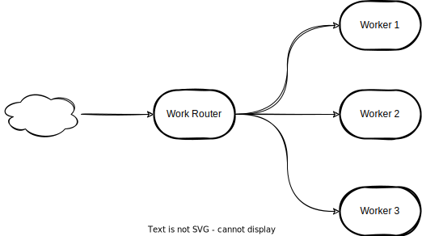
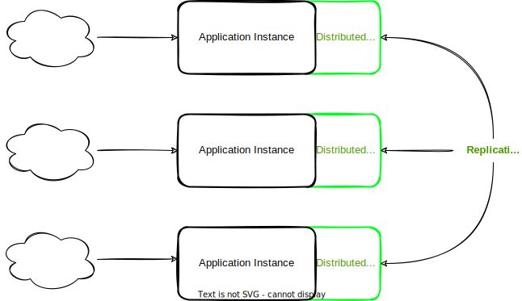

Akka Cluster provides a fault-tolerant decentralized peer-to-peer based Cluster Membership Service with no single point of failure or single point of bottleneck.

Akka Cluster allows for building distributed applications, where one application or service spans multiple nodes.

# Use cases :
An architectural choice you have to make is if you are going to use a microservices architecture or a traditional distributed application. This choice will influence how you should use Akka Cluster.

Akka is well known to :
- providing a way to distribute Akka Actors across a cluster.
- helping in distirbuting large tasks across a cluster.

# Terminologie

**node**
    A logical member of a cluster. There could be multiple nodes on a physical machine. Defined by a hostname:port:uid tuple.

**cluster**
    A set of nodes joined together through the Cluster Membership Service.

**leader**
    A single node in the cluster that acts as the leader. Managing cluster convergence and membership state transitions. 

**Seed Nodes**
The seed nodes are contact points for new nodes joining the cluster. When a new node is started it sends a message to all seed nodes and then sends a join command to the seed node that answers first.

The seed nodes configuration value does not have any influence on the running cluster itself, it is only relevant for new nodes joining the cluster as it helps them to find contact points to send the join command to; a new member can send this command to any current member of the cluster, not only to the seed nodes.

# Fundamentals
In this aricle, we will focus on the underlaying Akka Cluster Framework and in particular :
- the comunication mechanism
- failures scenarions
- how to manage akka clusters

It will help you for :
- architecting your system
- dubegging a cluster
- managing failures and recover from them
- and more ...

## So, what is Akka Cluster ?
Akka Cluster provides a way to distribute Akka actors accross a cluster of nodes. This distribution framework allows to overcome many resource limitations that we found in traditional systems.

With Akka Cluster, we can :
- distribute large tasks across of bunch of machines
- build a cache layer and share critical data across nodes without additional infrastructure
- reduce the traffic to an overloaded database

**Typical use cases**

- **Large workloads**
  

* Some requests are large to be computed on a single machine
* Scale computations of Tasks to meet demand
* Cost effectiveness : machines with average memory are cheaper then ones with more memory.

- **Distriuted Data/State**

- Provides local, replicated in-memory data storage
- Fast access (super fast caching)
- No additinal external caching service

## Cluster Creation
TBC

## Cluster Failures

## Resources :
- https://academy.lightbend.com/courses/course-v1:lightbend+LAC-Fundamentals+v1/course/
- https://www.freecodecamp.org/news/how-to-make-a-simple-application-with-akka-cluster-506e20a725cf/
- https://youtu.be/qDr6WHFa1TI