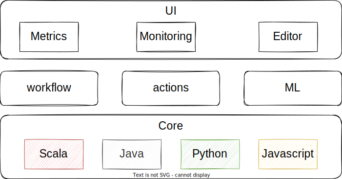
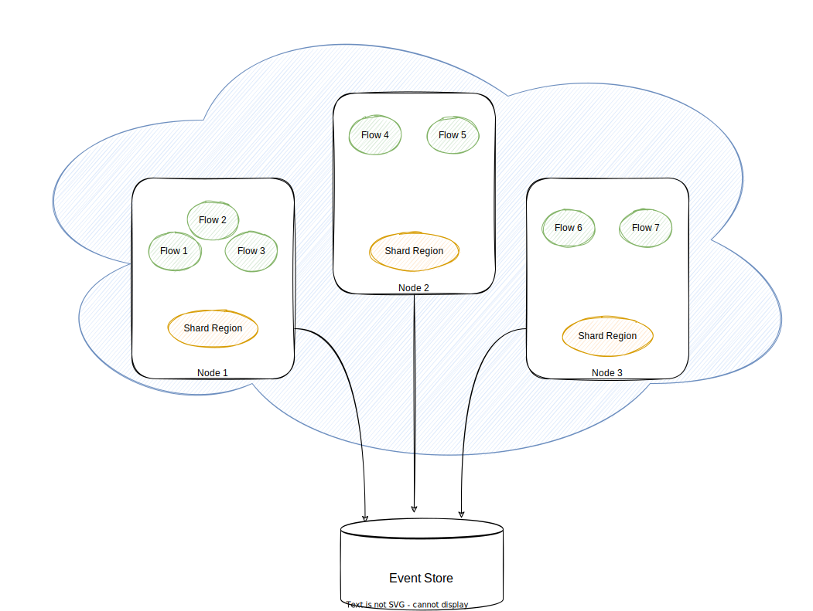
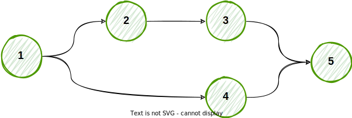
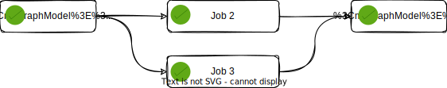
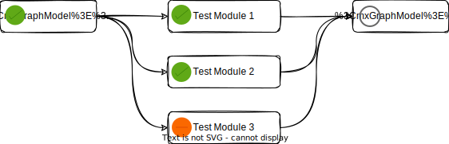

# Introduction
Nebula is a general purpose workflow engine that runs workflows in a distributed fashion. It provides high-level APIs in Java, Scala, Python and JavaScript, and a workflow engine that supports DAG execution. It also supports a set of high-level tools such as Nebula-Actions for CICD pipelines support, Nebula-ML to manage the ML lifecycle.

# Concepts

A workflow is represented as a DAG and contains Tasks, which are individual pieces of work. In a DAG, tasks are arranged with dependencies and data/metadata flows taken into account.

A Nebula installation generally consists of the following components:
- One or more Master nodes
- One or more Worker nodes
- Event Store

**Sharding**
A shard is a group of `Flows` that will be managed together. The grouping is typically defined by a hashing function of the `FlowId`. For a specific `Flow` identifier the shard identifier must always be the same. Otherwise the Flow might accidentally be started in several places at the same time.

The shards are allocated to the nodes in the cluster. The decision of where to allocate a shard is done by a shard allocation strategy. 

**State Persistence**
When using sharding, Flows can be moved to different nodes in the cluster. Persistence can be used to recover the state of a Flow after it has moved.

**Artifact Persistence**
`TBD`

## Nebula Core
The core module provides building blocks to create, schedule and monitor `Flow` instances. A `Flow` specifies the dependencies between `Tasks` and the order in which to execute them and run retries.

The `Tasks` descibe the work to do and can communicate metadata or `Task` results using a `FlowFile`. In core module, `FlowFile` is a wrapper around a JVM object that is serializable and give the freedom to implement the serialization method.

Core module implements the `FlowScheduler`, it monitors all `Tasks` and `Flows`, then triggers the task instances once their dependencies are complete.

## Nebula Workflow
`WorkFlow` module is build on top of `Flow` and provides high-level API to create job workflows. `WorkFlow` API implements all the boilerplate code used to initlize the flow and give access to the following objects :
- Working Directory : create temporary files, etc.
- `FlowFile` to exchange global variables, task variables and results.

The `WorkFlow` API come with build-in Tasks such as :
- SparkTask : to submit spark applications in Standalone mode.
- KubeCTLTask : to have access to the KubeCtl CLI 
- S3Task : to store or retrieve files from S3
- SFTPTask : to store or retrieve a file from SFTP
- JDBCTask : to query a JDBC database.
- ...

## Nebula Actions (CICD)
Like Workflow module, Actions is based on the core `Flow` object and it build and run CI/CD flows. The `ActionFlow` API provides out of the box capabilities in order to build a simple and rich CICD pipelines. The API gives access to the following objects :
- Working Directory : to clone `Git` repositories and run builds
- Artifact Store : to store build packages.
- `FlowFile` to exchange global variables, task variables and results.

The `ActionFlow` API come with build-in Tasks such as :
- GitTask : to manage Git repositories
- DockerTask : to build and push docker images easily
- ...

## Cluster Specification
### Node
A logical member of a cluster. There could be multiple nodes on a physical machine. Defined by a hostname:port:uid tuple.

### cluster
A set of nodes joined together through the Cluster Membership Service.

### leader
A single node in the cluster that acts as the leader. Managing cluster convergence and membership state transitions.

# Resources :
- https://gitlab.in2p3.fr/MaitresNageurs/QuatreNages/MultiLangages