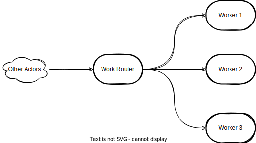

# Objectives
The aim of this project is to design and develop a distributed scheduler that satisfies the following objectives :
- Scalable
- Fault Tolerant
- Type-safe

# Concepts

`Scheduler` is a scheduling application that runs `workflows` in a distributed fashion.

A workflow is represented as a DAG (a Directed Acyclic Graph), and contains logical collection of work called `Stages`, arranged with dependencies and data flows taken into account.

A Stage is further composed of elementary steps called `Tasks` that describes what to do inside a Stage.

# Design 
## Work distribution

# Architecture

## Cluster Specification
### Node
A logical member of a cluster. There could be multiple nodes on a physical machine. Defined by a hostname:port:uid tuple.

### cluster
A set of nodes joined together through the Cluster Membership Service.

### leader
A single node in the cluster that acts as the leader. Managing cluster convergence and membership state transitions.
